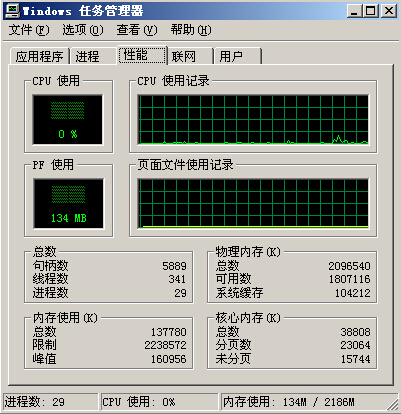
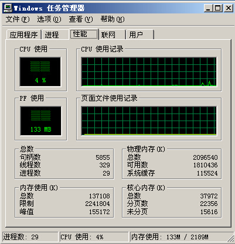

#AVL树->红黑树问题
=====

##问题描述
在Windows的虚拟内存管理中，将VAD组织成AVL树。VAD树是一种平衡二叉树。  
红黑树也是一种自平衡二叉查找树，在Linux 2.6及其以后版本的内核中，采用红黑树来维护内存块。  
请尝试参考Linux源代码将WRK源代码中的VAD树由AVL树替换成红黑树。  

##知识背景

###AVL树
在计算机科学中，AVL树是最先发明的自平衡二叉查找树。在AVL树中任何节点的两个子树的高度最大差别为一，所以它也被称为高度平衡树。查找、插入和删除在平均和最坏情况下都是O（log n）。增加和删除可能需要通过一次或多次树旋转来重新平衡这个树。
节点的平衡因子是它的左子树的高度减去它的右子树的高度（有时相反）。带有平衡因子1、0或 -1的节点被认为是平衡的。带有平衡因子 -2或2的节点被认为是不平衡的，并需要重新平衡这个树。平衡因子可以直接存储在每个节点中，或从可能存储在节点中的子树高度计算出来。[[1]](http://zh.wikipedia.org/wiki/AVL%E6%A0%91)
###红黑树
红黑树是一种自平衡二叉查找树，是在计算机科学中用到的一种数据结构，典型的用途是实现关联数组。它是在1972年由鲁道夫·贝尔发明的，他称之为"对称二叉B树"，它现代的名字是在 Leo J. Guibas 和 Robert Sedgewick 于1978年写的一篇论文中获得的。它是复杂的，但它的操作有着良好的最坏情况运行时间，并且在实践中是高效的: 它可以在O(log n)时间内做查找，插入和删除，这里的n是树中元素的数目。[[2]](http://zh.wikipedia.org/wiki/%E7%BA%A2%E9%BB%91%E6%A0%91)

##WRK中的AVL
在`base/ntos/inc`中我找到了`ps.h`,其中定义了AVL树的根节点：

	typedef struct _MM_AVL_TABLE {
	    MMADDRESS_NODE  BalancedRoot;
	    ULONG_PTR DepthOfTree: 5;
	    ULONG_PTR Unused: 3;
	#if defined (_WIN64)
	    ULONG_PTR NumberGenericTableElements: 56;
	#else
	    ULONG_PTR NumberGenericTableElements: 24;
	#endif
	    PVOID NodeHint;
	    PVOID NodeFreeHint;
	} MM_AVL_TABLE, *PMM_AVL_TABLE;
这其中树的节点`MMADDRESS_NODE`的定义为：

	typedef struct _MMADDRESS_NODE {
	    union {
	        LONG_PTR Balance : 2;
	        struct _MMADDRESS_NODE *Parent;
	    } u1;
	    struct _MMADDRESS_NODE *LeftChild;
	    struct _MMADDRESS_NODE *RightChild;
	    ULONG_PTR StartingVpn;
	    ULONG_PTR EndingVpn;
	} MMADDRESS_NODE, *PMMADDRESS_NODE;
这其中有趣的一点是，AVL树中真正的根节点是`BalancedRoot`的`RightChild`，其`LeftChild`是空的。
知道了VAD树的root与node的定义就可以看代码了。  
在`base/ntos/mm/mi.h`中找到了添加和删除节点的接口：

	VOID
	FASTCALL
	MiInsertNode (
	    IN PMMADDRESS_NODE Node,
	    IN PMM_AVL_TABLE Root
	    );
>

	VOID
	FASTCALL
	MiRemoveNode (
	    IN PMMADDRESS_NODE Node,
	    IN PMM_AVL_TABLE Root
	    );
接下来我们将更改这个接口的代码来移植Linux中的红黑树。

##Linux中的红黑树
在Linux 2.6及其以后版本的内核中，采用红黑树来维护内存块。  
在网上随意找了一个`linux-2.6.27.6.tar.gz`，解压后在`./include/linux/rbtree.h`和`./lib/rbtree.c`分别找到了红黑树的头文件和代码。
其中红黑树的node与root结构体定义如下

	struct rb_node
	{
		unsigned long  rb_parent_color;
	#define	RB_RED		0
	#define	RB_BLACK	1
		struct rb_node *rb_right;
		struct rb_node *rb_left;
	} __attribute__((aligned(sizeof(long))));

>
	
	struct rb_root
	{
		struct rb_node *rb_node;
	};

`rb_root`比较特殊，这个指针需要我们在更改代码的时候特别注意。

同时在这一段中可以发现

	#define rb_parent(r)   ((struct rb_node *)((r)->rb_parent_color & ~3))
	#define rb_color(r)   ((r)->rb_parent_color & 1)
	#define rb_is_red(r)   (!rb_color(r))
	#define rb_is_black(r) rb_color(r)
	#define rb_set_red(r)  do { (r)->rb_parent_color &= ~1; } while (0)
	#define rb_set_black(r)  do { (r)->rb_parent_color |= 1; } while (0)
	
	static inline void rb_set_parent(struct rb_node *rb, struct rb_node *p)
	{
		rb->rb_parent_color = (rb->rb_parent_color & 3) | (unsigned long)p;
	}
	static inline void rb_set_color(struct rb_node *rb, int color)
	{
		rb->rb_parent_color = (rb->rb_parent_color & ~1) | color;
	}

`rb_node`中的最低一位被用于表示节点颜色（`#define rb_color(r)   ((r)->rb_parent_color & 1)`），这一做法十分机制，但为了避免不必要的错误，在移植的过程中我用`MMADDRESS_NODE->Balance`来存储颜色信息。  
从Linux 代码中我们将移植`__rb_rotate_left`、`__rb_rotate_right`、`__rb_erase_color`、`rb_insert_color`、`rb_erase`这几个函数。
##代码移植
为了用红黑树替换掉AVL树，我保留了VAD树的绝大部分内容，只对`MiInsertNode`和`MiRemoveNode`接口做修改。

	VOID
	FASTCALL
	MiInsertNode (
	    IN PMMADDRESS_NODE Node,
	    IN PMM_AVL_TABLE Root
	    );
>

	VOID
	FASTCALL
	MiRemoveNode (
	    IN PMMADDRESS_NODE Node,
	    IN PMM_AVL_TABLE Root
	    );

在`MiInsertNode`中，仿照原始代码写入对新加入节点位置的寻找

    PMMADDRESS_NODE NodeOrParent,parent,gparent;
		TABLE_SEARCH_RESULT SearchResult;
		SearchResult = MiFindNodeOrParent (Table,
			NodeToInsert->StartingVpn,
			&NodeOrParent);
	
		NodeToInsert->LeftChild = NULL;
		NodeToInsert->RightChild = NULL;
	
		Table->NumberGenericTableElements += 1;
		if (SearchResult == TableEmptyTree) {
	
			Table->BalancedRoot.RightChild = NodeToInsert;
			rb_set_parent(NodeToInsert,&Table->BalancedRoot);
	
		}
		else {
	
			if (SearchResult == TableInsertAsLeft) {
				NodeOrParent->LeftChild = NodeToInsert;
			}
			else {
				NodeOrParent->RightChild = NodeToInsert;
			}
	
			rb_set_parent(NodeToInsert,NodeOrParent);
			//To Be Continue
这里调用了一个原生的寻找符合节点的函数`MiFindNodeOrParent`

	TABLE_SEARCH_RESULT
	MiFindNodeOrParent (
	    IN PMM_AVL_TABLE Table,
	    IN ULONG_PTR StartingVpn,
	    OUT PMMADDRESS_NODE *NodeOrParent
	    );
其返回的`TABLE_SEARCH_RESULT`枚举类型包含`TableEmptyTree`、`TableFoundNode`、`TableInsertAsLeft`、`TableInsertAsRight`。
利用这一结果插入节点的工作量被大大减小。
之后为了调整红黑树的平衡性要求，在这里直接将`rb_insert_color`函数的内容拿过来。
Linux 源码见附录。  
移植过来的内容如下：

			NodeToInsert->u1.Balance = rb_red ;
			while((parent=SANITIZE_PARENT_NODE(NodeToInsert->u1.Parent)) && rb_is_red(parent) )
			{
				gparent = rb_parent(parent);
				if(parent == gparent->LeftChild)
				{
					{
						PMMADDRESS_NODE uncle = gparent->RightChild;
						if ( uncle && rb_is_red ( uncle ))
						{
							rb_set_black(uncle);
							rb_set_black(parent);
							rb_set_red(gparent);
							NodeToInsert = gparent;
							continue;
						}
					}
					if(parent->RightChild == NodeToInsert)
					{
						register PMMADDRESS_NODE tmp;
						rb_rotate_left(parent,Table);
						tmp = parent;
						parent = NodeToInsert;
						NodeToInsert = tmp;
					}
					rb_set_black(parent);
					rb_set_red(gparent);
					rb_rotate_right(gparent,Table);
				}
				else
				{
					{
						register PMMADDRESS_NODE uncle = gparent->LeftChild;
						if (uncle && rb_is_red(uncle))
						{
							rb_set_black(uncle);
							rb_set_black(parent);
							rb_set_red(gparent);
							NodeToInsert = gparent;
							continue;
						}
					}

					if (parent->LeftChild == NodeToInsert)
					{
						register PMMADDRESS_NODE tmp;
						rb_rotate_right(parent, Table);
						tmp = parent;
						parent = NodeToInsert;
						NodeToInsert = tmp;
					}

					rb_set_black(parent);
					rb_set_red(gparent);
					rb_rotate_left(gparent,Table);
				}
			}
			rb_set_black(Table->BalancedRoot.RightChild);

删除节点也是直接拿`rb_erase`的代码，在这里忍不住称赞Linux代码的可读性和移植便利。搞清依赖关系后几乎只用做替换就可以移植过来。
Linux 源码见附录。  
移植过来的内容如下：

		PMMADDRESS_NODE child,parent;
		int color;
		
		if(!NodeToDelete->LeftChild)
			child=NodeToDelete->RightChild;
		else if(!NodeToDelete->RightChild)
			child=NodeToDelete->LeftChild;
		else
		{
			PMMADDRESS_NODE old,left;
			old = NodeToDelete;
			NodeToDelete = NodeToDelete->RightChild;
			while((left=NodeToDelete->LeftChild)!=NULL)
				NodeToDelete = left;
			if(rb_parent(old))
			{
				if(rb_parent(old)->LeftChild == old)
					rb_parent(old)->LeftChild = NodeToDelete;
				else
					rb_parent(old)->RightChild = NodeToDelete;
			}
			else
			{
				(Table->BalancedRoot).RightChild = NodeToDelete;
			}
			child = NodeToDelete->RightChild;
			parent = rb_parent(NodeToDelete);
			color = rb_color(NodeToDelete);
		
			if (parent == old) {
				parent = NodeToDelete;
			} else {
				if (child)
					rb_set_parent(child, parent);
				parent->LeftChild = child;
		
				NodeToDelete->RightChild = old->RightChild;
				rb_set_parent(old->RightChild, NodeToDelete);
			}
			NodeToDelete->u1.Parent = old->u1.Parent;
			NodeToDelete->LeftChild = old->LeftChild;
			rb_set_parent(old->LeftChild, NodeToDelete);
		
			goto color;
		}
		
		parent = rb_parent(NodeToDelete);
		color = rb_color(NodeToDelete);
		
		if (child)
			rb_set_parent(child, parent);
		if (parent)
		{
			if (parent->LeftChild == NodeToDelete)
				parent->LeftChild = child;
			else
				parent->RightChild = child;
		}
		else
			Table->BalancedRoot.RightChild = child;
		
	color:
		if (color == rb_black)
			rb_erase_color(child, parent, Table);
		
		Table->NumberGenericTableElements-=1;
			
		return;

除此之外我们还要移植`__rb_rotate_left`、`__rb_rotate_right`、`__rb_erase_color`这三个函数，和在`rbtree.h`定义的一些宏操作。对函数的操作和上述相同，只需要将  
`rb_node *`替换为`PMMADDRESS_NODE`；  
`rb_root *` 替换为`PMM_AVL_TABLE`；  
`rb_left` 替换为`LeftChild`;  
`rb_right` 替换为`RightChild`;  
`root->rb_node`替换为`root->BalancedRoot.RightChild`

这里对第一个和第五个替换略显奇怪的原因可以在上述`rb_node`定义与AVL树的真·根节点为`BalancedRoot`右子中找到答案。
由于我们用`Balance`变量作为颜色的标示，所以需要对原`rbtree.h`中的宏操作做修改，修改后内容如下

	#define rb_black 0
	#define rb_red 1
	
	PMMADDRESS_NODE rb_parent(PMMADDRESS_NODE node)
	{
		node=SANITIZE_PARENT_NODE(node->u1.Parent);
		return node;
	}
	int rb_color(PMMADDRESS_NODE node)
	{
		return node->u1.Balance;
	}
	int rb_is_red(PMMADDRESS_NODE node)
	{
		return (node->u1.Balance)&1;
	}
	int rb_is_black(PMMADDRESS_NODE node)
	{
		return !((node->u1.Balance)&1);
	}
	void rb_set_black(PMMADDRESS_NODE node)
	{
		node->u1.Balance=rb_black;
	}
	void rb_set_red(PMMADDRESS_NODE node)
	{
		node->u1.Balance=rb_red;
	}
	void rb_set_parent( PMMADDRESS_NODE rb,PMMADDRESS_NODE p)
	{
		rb->u1.Parent =(PMMADDRESS_NODE) (rb_color(rb) +(unsigned long) p);
	}
Linux 源码见附录，由于函数中替换并没有实质性的更改代码逻辑，在此不贴出移植后的`__rb_rotate_left`、`__rb_rotate_right`、`__rb_erase_color`这三个函数的代码。
至此，移植工作完成。

##调试与结果
在移植代码前期的主要问题都出在对代码变量定义的不清晰，先是忘了`rbtree.h`中的宏定义，再是`rb_rotate_left``rb_rotate_right`函数移植时指针搞错了。由于nmake似乎在win8.1上不能正常运行，我也懒得再8.1上装SDK，于是乎就用git把代码从主机折腾到虚拟机上，再编译重启看问题。  
由于wrk和Linux源码的可读性都十分出色，里面还有详尽的注释来解释逻辑，在调试的时候没有遇到代码逻辑上的错误。不得不说这次的作业虽然看上去难点十足，但真正做下来收获绝对比遇到的困难要大。  
更改完内核运行的系统感觉并没有什么差异，由于虚拟机上也没有装大型软件，在用户操作上体会不到。  
截图了两张WinServer原内核和修改后的wrk内核的任务管理器截图，同样也看不出太大区别。  

###参考资料
[AVL树](http://zh.wikipedia.org/wiki/AVL%E6%A0%91)  
[红黑树](http://zh.wikipedia.org/wiki/%E7%BA%A2%E9%BB%91%E6%A0%91)  
[内核移植](http://www.verydemo.com/demo_c116_i10238.html)
###附录：Git Repo
	
	git clone https://github.com/jas0n1ee/WRK_RBTREE_EXP
###附录：Linux rbtree源码
`./include/linux/rbtree.h`代码节选

	struct rb_node
	{
		unsigned long  rb_parent_color;
	#define	RB_RED		0
	#define	RB_BLACK	1
		struct rb_node *rb_right;
		struct rb_node *rb_left;
	} __attribute__((aligned(sizeof(long))));
	    /* The alignment might seem pointless, but allegedly CRIS needs it */
	
	struct rb_root
	{
		struct rb_node *rb_node;
	};
	
	
	#define rb_parent(r)   ((struct rb_node *)((r)->rb_parent_color & ~3))
	#define rb_color(r)   ((r)->rb_parent_color & 1)
	#define rb_is_red(r)   (!rb_color(r))
	#define rb_is_black(r) rb_color(r)
	#define rb_set_red(r)  do { (r)->rb_parent_color &= ~1; } while (0)
	#define rb_set_black(r)  do { (r)->rb_parent_color |= 1; } while (0)
	
	static inline void rb_set_parent(struct rb_node *rb, struct rb_node *p)
	{
		rb->rb_parent_color = (rb->rb_parent_color & 3) | (unsigned long)p;
	}
	static inline void rb_set_color(struct rb_node *rb, int color)
	{
		rb->rb_parent_color = (rb->rb_parent_color & ~1) | color;
	}
	
	#define RB_ROOT	(struct rb_root) { NULL, }
	#define	rb_entry(ptr, type, member) container_of(ptr, type, member)
	
	#define RB_EMPTY_ROOT(root)	((root)->rb_node == NULL)
	#define RB_EMPTY_NODE(node)	(rb_parent(node) == node)
	#define RB_CLEAR_NODE(node)	(rb_set_parent(node, node))
	
	extern void rb_insert_color(struct rb_node *, struct rb_root *);
	extern void rb_erase(struct rb_node *, struct rb_root *);
	
	/* Find logical next and previous nodes in a tree */
	extern struct rb_node *rb_next(struct rb_node *);
	extern struct rb_node *rb_prev(struct rb_node *);
	extern struct rb_node *rb_first(struct rb_root *);
	extern struct rb_node *rb_last(struct rb_root *);
	
	/* Fast replacement of a single node without remove/rebalance/add/rebalance */
	extern void rb_replace_node(struct rb_node *victim, struct rb_node *new, 
				    struct rb_root *root);
	
	static inline void rb_link_node(struct rb_node * node, struct rb_node * parent,
					struct rb_node ** rb_link)
	{
		node->rb_parent_color = (unsigned long )parent;
		node->rb_left = node->rb_right = NULL;
	
		*rb_link = node;
	}

`./lib/rbtree.c`代码节选

	static void __rb_rotate_left(struct rb_node *node, struct rb_root *root)
	{
		struct rb_node *right = node->rb_right;
		struct rb_node *parent = rb_parent(node);
	
		if ((node->rb_right = right->rb_left))
			rb_set_parent(right->rb_left, node);
		right->rb_left = node;
	
		rb_set_parent(right, parent);
	
		if (parent)
		{
			if (node == parent->rb_left)
				parent->rb_left = right;
			else
				parent->rb_right = right;
		}
		else
			root->rb_node = right;
		rb_set_parent(node, right);
	}
	
	static void __rb_rotate_right(struct rb_node *node, struct rb_root *root)
	{
		struct rb_node *left = node->rb_left;
		struct rb_node *parent = rb_parent(node);
	
		if ((node->rb_left = left->rb_right))
			rb_set_parent(left->rb_right, node);
		left->rb_right = node;
	
		rb_set_parent(left, parent);
	
		if (parent)
		{
			if (node == parent->rb_right)
				parent->rb_right = left;
			else
				parent->rb_left = left;
		}
		else
			root->rb_node = left;
		rb_set_parent(node, left);
	}
	
	void rb_insert_color(struct rb_node *node, struct rb_root *root)
	{
		struct rb_node *parent, *gparent;
	
		while ((parent = rb_parent(node)) && rb_is_red(parent))
		{
			gparent = rb_parent(parent);
	
			if (parent == gparent->rb_left)
			{
				{
					register struct rb_node *uncle = gparent->rb_right;
					if (uncle && rb_is_red(uncle))
					{
						rb_set_black(uncle);
						rb_set_black(parent);
						rb_set_red(gparent);
						node = gparent;
						continue;
					}
				}
	
				if (parent->rb_right == node)
				{
					register struct rb_node *tmp;
					__rb_rotate_left(parent, root);
					tmp = parent;
					parent = node;
					node = tmp;
				}
	
				rb_set_black(parent);
				rb_set_red(gparent);
				__rb_rotate_right(gparent, root);
			} else {
				{
					register struct rb_node *uncle = gparent->rb_left;
					if (uncle && rb_is_red(uncle))
					{
						rb_set_black(uncle);
						rb_set_black(parent);
						rb_set_red(gparent);
						node = gparent;
						continue;
					}
				}
	
				if (parent->rb_left == node)
				{
					register struct rb_node *tmp;
					__rb_rotate_right(parent, root);
					tmp = parent;
					parent = node;
					node = tmp;
				}
	
				rb_set_black(parent);
				rb_set_red(gparent);
				__rb_rotate_left(gparent, root);
			}
		}
	
		rb_set_black(root->rb_node);
	}
	EXPORT_SYMBOL(rb_insert_color);
	
	static void __rb_erase_color(struct rb_node *node, struct rb_node *parent,
				     struct rb_root *root)
	{
		struct rb_node *other;
	
		while ((!node || rb_is_black(node)) && node != root->rb_node)
		{
			if (parent->rb_left == node)
			{
				other = parent->rb_right;
				if (rb_is_red(other))
				{
					rb_set_black(other);
					rb_set_red(parent);
					__rb_rotate_left(parent, root);
					other = parent->rb_right;
				}
				if ((!other->rb_left || rb_is_black(other->rb_left)) &&
				    (!other->rb_right || rb_is_black(other->rb_right)))
				{
					rb_set_red(other);
					node = parent;
					parent = rb_parent(node);
				}
				else
				{
					if (!other->rb_right || rb_is_black(other->rb_right))
					{
						struct rb_node *o_left;
						if ((o_left = other->rb_left))
							rb_set_black(o_left);
						rb_set_red(other);
						__rb_rotate_right(other, root);
						other = parent->rb_right;
					}
					rb_set_color(other, rb_color(parent));
					rb_set_black(parent);
					if (other->rb_right)
						rb_set_black(other->rb_right);
					__rb_rotate_left(parent, root);
					node = root->rb_node;
					break;
				}
			}
			else
			{
				other = parent->rb_left;
				if (rb_is_red(other))
				{
					rb_set_black(other);
					rb_set_red(parent);
					__rb_rotate_right(parent, root);
					other = parent->rb_left;
				}
				if ((!other->rb_left || rb_is_black(other->rb_left)) &&
				    (!other->rb_right || rb_is_black(other->rb_right)))
				{
					rb_set_red(other);
					node = parent;
					parent = rb_parent(node);
				}
				else
				{
					if (!other->rb_left || rb_is_black(other->rb_left))
					{
						register struct rb_node *o_right;
						if ((o_right = other->rb_right))
							rb_set_black(o_right);
						rb_set_red(other);
						__rb_rotate_left(other, root);
						other = parent->rb_left;
					}
					rb_set_color(other, rb_color(parent));
					rb_set_black(parent);
					if (other->rb_left)
						rb_set_black(other->rb_left);
					__rb_rotate_right(parent, root);
					node = root->rb_node;
					break;
				}
			}
		}
		if (node)
			rb_set_black(node);
	}
	
	void rb_erase(struct rb_node *node, struct rb_root *root)
	{
		struct rb_node *child, *parent;
		int color;
	
		if (!node->rb_left)
			child = node->rb_right;
		else if (!node->rb_right)
			child = node->rb_left;
		else
		{
			struct rb_node *old = node, *left;
	
			node = node->rb_right;
			while ((left = node->rb_left) != NULL)
				node = left;
			child = node->rb_right;
			parent = rb_parent(node);
			color = rb_color(node);
	
			if (child)
				rb_set_parent(child, parent);
			if (parent == old) {
				parent->rb_right = child;
				parent = node;
			} else
				parent->rb_left = child;
	
			node->rb_parent_color = old->rb_parent_color;
			node->rb_right = old->rb_right;
			node->rb_left = old->rb_left;
	
			if (rb_parent(old))
			{
				if (rb_parent(old)->rb_left == old)
					rb_parent(old)->rb_left = node;
				else
					rb_parent(old)->rb_right = node;
			} else
				root->rb_node = node;
	
			rb_set_parent(old->rb_left, node);
			if (old->rb_right)
				rb_set_parent(old->rb_right, node);
			goto color;
		}
	
		parent = rb_parent(node);
		color = rb_color(node);
	
		if (child)
			rb_set_parent(child, parent);
		if (parent)
		{
			if (parent->rb_left == node)
				parent->rb_left = child;
			else
				parent->rb_right = child;
		}
		else
			root->rb_node = child;
	
	 color:
		if (color == RB_BLACK)
			__rb_erase_color(child, parent, root);
	}
	EXPORT_SYMBOL(rb_erase);